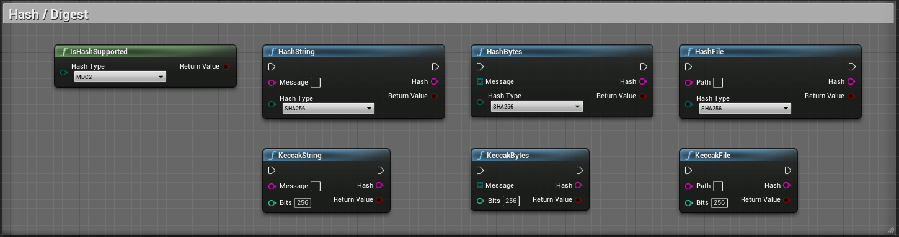
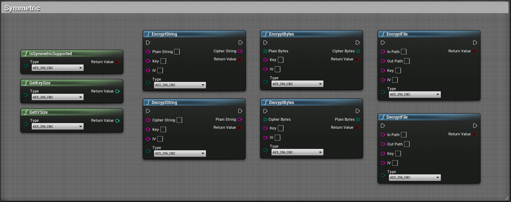

# CryptoHelper

- UE Plugin exposing easy to use cryptographic algrorithm for security purposes (Hash/Digest, HMAC, Salt, Symmetric encryption, Asymmetric encryption)
- Handle Bytes/String/File data in an efficient way using buffer when the input is too long to be loaded in memory
- Useful to encrypt data to send it across the network or to save it onto a machine
- You can also verify the integrity of a message or sign a message to prove its authenticity
- This is a blueprint library plugin
- It exposes 40+ functions to improve security in your project
- Can be used in any blueprint

 

##

    Supported algorithms may vary as updates go on, they are available through the enums EDigestAlgorithm and ESymmetricAlgorithm and EAsymmetricAlgorithm. In order to check if your platform supports a specific algorithm use IsDigestSupported or IsSymmetricSupported functions.
    
    The recommended algorithm and version is already set as the default option for all functions below, try not to use outdated version as it may cause a security breach inside your application.

    Most of these functions RETURN and NEED an HEXADECIMAL string

 

| Type | Algorithms |
| -----| ---------- |
| Hash - Digest | MDC2, MD4, MD5, MD5-SHA1, SHA1, SHA224, SHA256, SHA384, SHA512-224, SHA512-256, SHA512, SHA3-224, SHA3-256, SHA3-384, SHA3-512, RIPEMD160, WHIRLPOOL, SHAKE-128, SHAKE-256, KECCAK-224, KECCAK-256, KECCAK-384, KECCAK-512 |
| Symmetric | AES-128-ECB, AES-128-CBC, AES-192-ECB, AES-192-CBC, AES-256-ECB, AES-256-CBC, BLOWFISH-ECB, BLOWFISH-CBC, CAMELLIA-128-ECB, CAMELLIA-128-CBC, CAMELLIA-192-ECB, CAMELLIA-192-CBC, CAMELLIA-256-ECB, CAMELLIA-256-CBC |
| Asymmetric | RSA, DSA |

 

# Hash - Digest

    One-way function that transform the data of an arbitrary size (message) to a bit array of a fixed size (hash). It is used to verify integrity of a message.

| Node | Inputs | Outputs | Note |
| -------- | ---- | ---- | ---- |
| IsDigestSupported | HashType(EDigestAlgorithm) | Bool | Checks if a specific algorithm is supported by the current platform |
| DigestString | Message(String), HashType(EDigestAlgorithm) | Result(Bool), Hash(String) | Digest a message using a specific algorithm, returns an empty string if it failed and an HEXADECIMAL string on success |
| DigestBytes | Message(Array(Byte)), HashType(EDigestAlgorithm) | Result(Bool), Hash(String) | Digest a bytes message using a specific algorithm, returns an empty string if it failed and an HEXADECIMAL string on success |
| DigestFile | Path(String), HashType(EDigestAlgorithm) | Result(Bool), Hash(String) | Digest a file using a specific algorithm, returns an empty string if it failed and an HEXADECIMAL string on success |
| KeccakString | Message(String), Bits(Int) | Result(Bool), Hash(String) | Digest a string using the keccak algorithm for (224, 256, 384, 512) bits, returns an empty string if it failed and an HEXADECIMAL string on success |
| KeccakBytes | Message(Array(Byte)), Bits(Int) | Result(Bool), Hash(String) | Digest a bytes message using the keccak algorithm for (224, 256, 384, 512) bits, returns an empty string if it failed and an HEXADECIMAL string on success |
| KeccakFile | Path(String), Bits(Int) | Result(Bool), Hash(String) | Digest a file using the keccak algorithm for (224, 256, 384, 512) bits, returns an empty string if it failed and an HEXADECIMAL string on success |

 

# HMAC

    Hash-based Message Authentication Code : cryptographic hash function and a secret cryptographic key used to simultaneously verify both the data integrity and the authenticity of a message.

| Node | Inputs | Outputs | Note |
| -------- | ---- | ---- | ---- |
| HMACString | Message(String), Key(String), HashType(EDigestAlgorithm) | String | Digest a string message using a specific key and algorithm, returns an empty string if it failed and an HEXADECIMAL string on success |
| HMACBytes | Message(Array(Byte)), Key(String), HashType(EDigestAlgorithm) | String | Digest a bytes array message using a specific key and algorithm, returns an empty string if it failed and an HEXADECIMAL string on success |
| HMACFile | Path(String), Key(String), HashType(EDigestAlgorithm) | Result(Bool), Hash(String) | Digest a file using a specific key and algorithm, returns an empty string if it failed and an HEXADECIMAL string on success |

 

# Salt

    Salt is random data that is used as an additional input to a one-way function that hashes data, it is used to protect against duplicate or common passwords being identifiable.

| Node | Inputs | Outputs | Note |
| -------- | ---- | ---- | ---- |
| RandomDictionaryString | Length(Int), Dictionary(String) | Result(Bool), Salt(String) | Generates a random string of a specific length, from a dictionary string provided, you can add duplicates if you want more probability for a specific character to be picked |
| RandomBytes | Length(Int) | Result(Bool), Salt(Array(Byte)) | Generates a random bytes array of a specific length |

 

# Symmetric

    Encryption that uses the same cryptographic keys for both the encryption of plaintext and the decryption of ciphertext. Symmetric-key algorithms require both the sender and the recipient of a message to have the same secret key. Message can be of any length.

| Node | Inputs | Outputs | Note |
| -------- | ---- | ---- | ---- |
| IsSymmetricSupported | Type(ESymmetricAlgorithm) | Bool | Checks if a specific algorithm is supported by the current platform |
| GetIVSize | Type(ESymmetricAlgorithm) | Int | Returns the size required for the initialization vector of a specific algorithm |
| GetKeySize | Type(ESymmetricAlgorithm) | Int | Returns the size required for the key of a specific algorithm |
| EncryptString | Plain(String), Key(String), IV(String), Type(ESymmetricAlgorithm) | Result(Bool), Cipher(String) | Encrypts a plain string using the provided key and initialization vector and the specific algorithm, returns an HEXADECIMAL cipher string |
| DecryptString | Cipher(String), Key(String), IV(String), Type(ESymmetricAlgorithm) | Result(Bool), Plain(String) | Decrypts an HEXADECIMAL cipher string using the provided key and initialization vector and the specific algorithm |
| EncryptBytes | Plain(Array(Byte)), Key(String), IV(String), Type(ESymmetricAlgorithm) | Result(Bool), Cipher(Array(Byte)) | Encrypts a plain bytes array using the provided key and initialization vector and the specific algorithm |
| DecryptBytes | Cipher(Array(Byte)), Key(String), IV(String), Type(ESymmetricAlgorithm) | Result(Bool), Plain(Array(Byte)) | Decrypts a cipher bytes array using the provided key and initialization vector and the specific algorithm |
| EncryptFile | InPath(String), OutPath(String), Key(String), IV(String), Type(ESymmetricAlgorithm) | Result(Bool) | Encrypts a plain file using the provided key and initialization vector and the specific algorithm |
| DecryptFile | InPath(String), OutPath(String), Key(String), IV(String), Type(ESymmetricAlgorithm) | Result(Bool) | Decrypts a cipher file using the provided key and initialization vector and the specific algorithm |

 

# Asymmetric

    Encryption that uses pairs of keys. Each pair consists of a public key that can be shared to others and a private key that must be kept secret. Message cannot be of any length. This type of encryption should be used to exchange symmetric key between two parties.

| Node | Inputs | Outputs | Note |
| -------- | ---- | ---- | ---- |
| GenerateKeychain | Options(FKeychainOptions) | Result(Bool), Keychain(FKeyChain) | Generates a keychain using specific options provided |
| GetKeySize | Key(String), IsPublic(Bool), KeyType(EAsymmetricAlgorithm) | Int | Returns the size of the key provided for a specific algorithm |
| GetMaxMessageSize | Key(String), IsPublic(Bool), KeyType(EAsymmetricAlgorithm) | Int | Returns the max size of the message for a specific key and algorithm |
| EncryptString | Plain(String), PublicKey(String), KeyType(EAsymmetricAlgorithm) | Result(Bool), Cipher(String) | Encrypts a plain string with the provided algorithm public key, returns an HEXADECIMAL cipher string |
| DecryptString | Cipher(String), PrivateKey(String), KeyType(EAsymmetricAlgorithm) | Result(Bool), Plain(String) | Decrypts an HEXADECIMAL cipher string with the provided algorithm private key |
| EncryptBytes | Plain(Array(Byte)), PublicKey(String), KeyType(EAsymmetricAlgorithm) | Result(Bool), Cipher(Array(Byte)) | Encrypts a plain bytes array with the provided algorithm public key |
| DecryptBytes | Cipher(Array(Byte)), PrivateKey(String), KeyType(EAsymmetricAlgorithm) | Result(Bool), Plain(Array(Byte)) | Decrypts a cipher bytes array with the provided algorithm private key |
| SignString | Message(String), PrivateKey(String), KeyType(EAsymmetricAlgorithm), HashType(EDigestAlgorithm) | Result(Bool), Signature(String) | Signs a message string with the provided algorithm private key, returns an HEXADECIMAL signature string |
| VerifyString | Message(String), Signature(String), PublicKey(String), KeyType(EAsymmetricAlgorithm), HashType(EDigestAlgorithm) | Result(Bool), IsAuthentic(Bool) | Verifies a message string with the provided algorithm public key and an HEXADECIMAL signature |
| SignBytes | Message(Array(Byte)), PrivateKey(String), KeyType(EAsymmetricAlgorithm), HashType(EDigestAlgorithm) | Result(Bool), Signature(String) | Signs a message bytes array with the provided algorithm private key, returns an HEXADECIMAL signature string |
| VerifyString | Message(Array(Byte)), Signature(String), PublicKey(String), KeyType(EAsymmetricAlgorithm), HashType(EDigestAlgorithm) | Result(Bool), IsAuthentic(Bool) | Verifies a message bytes array with the provided algorithm public key and an HEXADECIMAL signature |
| SignFile | Path(String), PrivateKey(String), KeyType(EAsymmetricAlgorithm), HashType(EDigestAlgorithm) | Result(Bool), Signature(String) | Signs a message file with the provided algorithm private key, returns an HEXADECIMAL signature string |
| VerifyFile | Path(String), Signature(String), PublicKey(String), KeyType(EAsymmetricAlgorithm), HashType(EDigestAlgorithm) | Result(Bool), IsAuthentic(Bool) | Verifies a message file with the provided algorithm public key and an HEXADECIMAL signature |

 

# Utility functions

    These functions are used to convert data from one representation to another. (Hex, UTF-8, Base64)

| Node | Inputs | Outputs | Note |
| -------- | ---- | ---- | ---- |
| BytesToHex | Array(Byte) | String | Converts a bytes array into an hexadecimal string |
| HexToBytes | String | Array(Byte) | Converts an hexadecimal string into a bytes array |
| StringToBytes | String | Array(Byte) | Converts an UTF-8 string into a bytes array |
| BytesToString | Array(Byte) | String | Converts a bytes array into an UTF-8 string |
| Base64ToBytes | String | Array(Byte) | Converts a base64 string into a bytes array |
| BytesToBase64 | Array(Byte) | String | Converts a bytes array into a base64 string |
| StringToBase64 | String | String | Converts an UTF-8 string into a base64 string |
| Base64ToString | String | String | Converts a base64 string into an UTF-8 string |

 

# Contribution

- Special thanks to [Andrey Jivsov](https://github.com/brainhub) for its KECCAK implementation contribution  