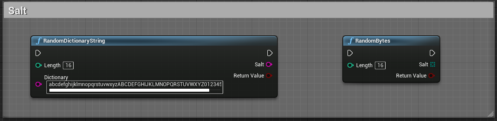

# Crypto Helper

 

# About

- UE plugin exposing cryptographic algorithms for security purposes (Hash/Digest, HMAC, Salt, Symmetric encryption, Asymmetric encryption, Sign/Verify)
- Handle byte/text/file data in an efficient way using buffers when the input is too long to be loaded into memory
- Useful to encrypt data to send it across the network or to save it onto a machine
- You can also verify the integrity of a message or sign a message to prove its authenticity
- It exposes easy to use blueprint functions to improve security in your project

 

# Setup

1. [Get the plugin on the marketplace](https://www.unrealengine.com/marketplace/en-US/product/crypto-helper-bp-library) and install the plugin for the engine version you wish to use
2. Create or open an unreal engine project with a supported version
3. In the editor, go to Edit/Plugins, search for the plugin, check the box to enable it and restart the editor
4. When a new plugin version is available, go to your Epic Games Launcher, under Unreal Engine/Library, below the engine version, you will find your installed plugins, find the plugin and click on update, then wait for it to finish and restart your editor

 

# Support

### Bugs/Issues

If you encounter issues with this plugin, you **should** report it, to do so, in the editor, go to Edit/Plugins, search for this plugin, click on the plugin support button, this will open your browser and navigate to the plugin issue form where you need to fill in all the relevant details about your issue, this will help me investigate and reproduce it on my own in order to fix it. Be precise and give as many details as you can. Once solved, a new plugin version will be submitted to the marketplace, update the plugin and you are good to go. **Due to epic marketplace limitations, I can only patch/update this plugin for the last 3 engine version, older engine versions will not be supported anymore.**

### Feature requests

If you want a new feature relevant to this plugin use case, you can submit a request in the [plugin marketplace question page](https://www.unrealengine.com/marketplace/en-US/product/crypto-helper-bp-library/questions). I **may** add this new feature in a future plugin version.

 

# Documentation
    
_Screenshots may differ from the latest plugin version, some features may have evolved or have been removed if deprecated._

_Keep in mind that supported algorithms may vary as updates go on, the recommended algorithm is already set as the default option for all functions below, try not to use outdated algorithm as it may cause a vulnerability in your application._

 

| Type | Algorithms |
| -----| ---------- |
| Hash / Digest | MDC2  MD4  MD5  MD5-SHA1  SHA1  SHA224  SHA256  SHA384  SHA512-224  SHA512-256  SHA512  SHA3-224  SHA3-256  SHA3-384  SHA3-512  RIPEMD160  WHIRLPOOL  SHAKE-128  SHAKE-256  KECCAK-224  KECCAK-256  KECCAK-384  KECCAK-512 |
| Symmetric | AES-128-CBC  AES-128-ECB  AES-128-CFB  AES-128-OFB  AES-128-CTR  AES-128-GCM  AES-128-CCM  AES-128-OCB  AES-192-CBC  AES-192-ECB  AES-192-CFB  AES-192-OFB  AES-192-CTR  AES-192-GCM  AES-192-CCM  AES-192-OCB  AES-256-CBC  AES-256-ECB  AES-256-CFB  AES-256-OFB  AES-256-CTR  AES-256-GCM  AES-256-CCM  AES-256-OCB  BLOWFISH-CBC  BLOWFISH-ECB  BLOWFISH-CFB  BLOWFISH-OFB  CAMELLIA-128-CBC  CAMELLIA-128-ECB  CAMELLIA-128-CFB  CAMELLIA-128-CTR  CAMELLIA-128-OFB  CAMELLIA-192-CBC  CAMELLIA-192-ECB  CAMELLIA-192-CFB  CAMELLIA-192-CTR  CAMELLIA-192-OFB  CAMELLIA-256-CBC  CAMELLIA-256-ECB  CAMELLIA-256-CFB  CAMELLIA-256-CTR  CAMELLIA-256-OFB  ChaCha20  DES_CBC  DES_ECB  DES_CFB  DES_OFB  DES_EDE_CBC  DES_EDE_ECB  DES_EDE_CFB  DES_EDE_OFB  DES_EDE3_CBC  DES_EDE3_ECB  DES_EDE3_CFB  DES_EDE3_OFB  RC4 |
| Asymmetric | RSA  DSA |
| Encoding | Hex  Base64  UTF-8 |

 

### Utility

_These functions are used to convert data from one character encoding to another. (Hex, UTF-8, Base64)._ 
    
**FCryptoHelperEncodedText** is a struct used as input and output for all crypto helper functions. It is used to clearly identify the encoding and facilitate conversions. By default, text inputs use UTF-8 and output use Hexadecimal.

**ECryptoHelperEncodingType** is an enum that contains all available character encoding. 

| Node | Inputs | Outputs | Note |
| ---- | ------ | ------- | ---- |
| EncodedTextToBytes | EncodedText | Array(Byte) | Converts encoded text to bytes |
| BytesToEncodedText | Array(Byte), Encoding(Enum) | EncodedText | Converts bytes into encoded text |
| EncodedTextToEncodedText | EncodedText, Encoding(Enum) | EncodedText | Converts encoded text to encoded text |
| . | EncodedText | String | Autocast encoded text to string |

 

### Hash - Digest

_One-way function that transform the data of an arbitrary size (message) to a bit array of a fixed size (hash). It is used to verify integrity of a message. This is not an encryption method._

**ECryptoHelperDigestAlgorithm** is an enum that contains all available hashing algorithms. You can check if your platform supports an algorithm by using the function **IsDigestSupported**.

The result of these functions is an encoded text using the hexadecimal encoding.

| Node | Inputs | Outputs | Note |
| -----| ------ | ------- | ---- |
| IsDigestSupported | HashType(Enum) | Bool | Checks if a specific algorithm is supported by the current platform |
| DigestString | Message, HashType(Enum) | Result(Bool), Hash | Digest a text message using a specific algorithm |
| DigestBytes | Message, HashType(Enum) | Result(Bool), Hash | Digest a byte message using a specific algorithm |
| DigestFile | Path, HashType(Enum) | Result(Bool), Hash | Digest a file using a specific algorithm |
| KeccakString | Message, Bits(Enum) | Result(Bool), Hash | Digest a text message using the keccak algorithm for (224, 256, 384, 512) bits |
| KeccakBytes | Message, Bits(Enum) | Result(Bool), Hash | Digest a byte message using the keccak algorithm for (224, 256, 384, 512) bits |
| KeccakFile | Path, Bits(Enum) | Result(Bool), Hash | Digest a file using the keccak algorithm for (224, 256, 384, 512) bits |

 

### Salt

_Salt is random data used as an additional input to a one-way function that hashes data, it is used to protect against duplicate or common passwords being identifiable._

| Node | Inputs | Outputs | Note |
| ---- | ------ | ------- | ---- |
| RandomDictionaryString | Length, Dictionary(String) | Result(Bool), Salt | Generates a random string of a specific length, from a dictionary string provided, you can add duplicates if you want more probability for a specific character to be picked |
| RandomBytes | Length | Result(Bool), Salt | Generates a random bytes array of a specific length |

 

### HMAC

_Hash-based Message Authentication Code is a one-way function that uses a secret cryptographic key to simultaneously verify both the data integrity and the authenticity of a message. This is not an encryption method._

**ECryptoHelperDigestAlgorithm** is an enum that contains all available hashing algorithms. You can check if your platform supports an algorithm by using the function **IsDigestSupported**. 

The result of these functions is an encoded text using the hexadecimal encoding.

| Node | Inputs | Outputs | Note |
| ---- | ------ | ------- | ---- |
| HMACString | Message, Key, HashType(Enum) | Result(Bool), Hash | Digest a string message using a specific key and algorithm |
| HMACBytes | Message, Key, HashType(Enum) | Result(Bool), Hash | Digest a byte array message using a specific key and algorithm |
| HMACFile | Path, Key, HashType(Enum) | Result(Bool), Hash | Digest a file using a specific key and algorithm |

 

### Symmetric

_Encryption that uses the same cryptographic keys for both the encryption of plaintext and the decryption of ciphertext. Symmetric-key algorithms require both the sender and the recipient of a message to have the same secret key. Message can be of any length._

**ECryptoHelperSymmetricAlgorithm** is an enum that contains all available symmetric algorithms. You can check if your platform supports an algorithm by using the function **IsSymmetricSupported**.

The result of these functions is an encoded text using the hexadecimal encoding.

| Node | Inputs | Outputs | Note |
| ---- | ------ | ------- | ---- |
| IsSymmetricSupported | AlgoType(Enum) | Bool | Checks if a specific algorithm is supported by the current platform |
| GetIVSize | AlgoType(Enum) | Int | Returns the size required for the initialization vector of a specific algorithm |
| GetKeySize | AlgoType(Enum) | Int | Returns the size required for the key of a specific algorithm |
| GetTagSize | AlgoType(Enum) | Int | Returns the size required for the tag of a specific algorithm |
| EncryptString | Plain, Key, IV, AlgoType(Enum) | Result(Bool), Cipher, Tag | Encrypts a plain text message using the provided key, initialization vector and algorithm |
| DecryptString | Cipher, Key, IV, Tag, AlgoType(Enum) | Result(Bool), Plain | Decrypts a cipher text using the provided key, initialization vector and algorithm |
| EncryptBytes | Plain, Key, IV, AlgoType(Enum) | Result(Bool), Cipher, Tag | Encrypts a plain byte array using the provided key, initialization vector and algorithm |
| DecryptBytes | Cipher, Key, IV, Tag, AlgoType(Enum) | Result(Bool), Plain | Decrypts a cipher byte array using the provided key, initialization vector and algorithm |
| EncryptFile | InPath, OutPath, Key, IV, AlgoType(Enum) | Result(Bool), Tag | Encrypts a plain file using the provided key, initialization vector and algorithm |
| DecryptFile | InPath, OutPath, Key, IV, Tag, AlgoType(Enum) | Result(Bool) | Decrypts a cipher file using the provided key, initialization vector and algorithm |

 

### Asymmetric

_Encryption that uses pairs of keys. Each pair consists of a public key that can be shared to others and a private key that must be kept secret. Message cannot be of any length. This type of encryption should be used to exchange symmetric key between two parties._

**FCryptoHelperKeychain** is a struct that contains matching public and private key with their generation options (Type, Size).

**ECryptoHelperAsymmetricAlgorithm** is an enum that contains all available asymmetric algorithms.

The result of these functions is an encoded text using the hexadecimal encoding.

| Node | Inputs | Outputs | Note |
| ---- | ------ | ------- | ---- |
| GenerateKeychain | Options | Result(Bool), Keychain | Generates a keychain (Public/Private) using specific options provided (Type, Size) |
| GetKeySize | Key, IsPublic(Bool), AlgoType(Enum) | Int | Returns the size of the key provided for a specific algorithm |
| GetMaxMessageSize | Key, IsPublic(Bool), AlgoType(Enum) | Int | Returns the max size of the message for a specific key and algorithm |
| EncryptString | Plain, PublicKey, AlgoType(Enum) | Result(Bool), Cipher | Encrypts a plain text message with the provided algorithm public key |
| DecryptString | Cipher, PrivateKey, AlgoType(Enum) | Result(Bool), Plain | Decrypts a cipher text with the provided algorithm private key |
| EncryptBytes | Plain, PublicKey, AlgoType(Enum) | Result(Bool), Cipher | Encrypts a plain byte array with the provided algorithm public key |
| DecryptBytes | Cipher, PrivateKey, AlgoType(Enum) | Result(Bool), Plain | Decrypts a cipher byte array with the provided algorithm private key |
| SignString | Message, PrivateKey, AlgoType(Enum), HashType(Enum) | Result(Bool), Signature | Signs a message string with the provided algorithm private key and hash type |
| VerifyString | Message, Signature, PublicKey, AlgoType(Enum), HashType(Enum) | Result(Bool), IsAuthentic(Bool) | Verifies a message string with the provided algorithm public key and hash type |
| SignBytes | Message, PrivateKey, AlgoType(Enum), HashType(Enum) | Result(Bool), Signature | Signs a byte message array with the provided algorithm private key and hash type |
| VerifyBytes | Message, Signature, PublicKey, AlgoType(Enum), HashType(Enum) | Result(Bool), IsAuthentic(Bool) | Verifies a byte message array with the provided algorithm public key and hash type |
| SignFile | Path, PrivateKey, AlgoType(Enum), HashType(Enum) | Result(Bool), Signature | Signs a file message with the provided algorithm private key and hash type |
| VerifyFile | Path, Signature, PublicKey, AlgoType(Enum), HashType(Enum) | Result(Bool), IsAuthentic(Bool) | Verifies a file message with the provided algorithm public key and hash type |

 

# Contribution

- Special thanks to [Andrey Jivsov](https://github.com/brainhub) for the KECCAK implementation contribution  